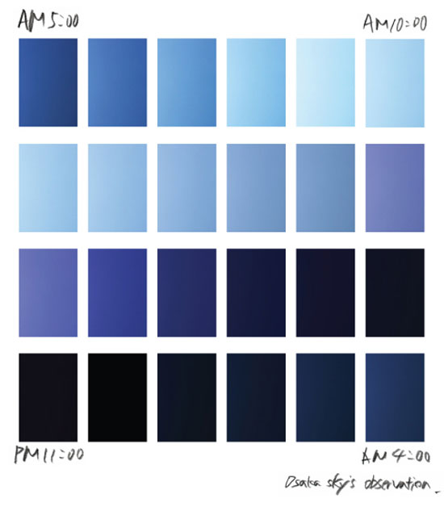

# react-dynamic-inline-styles

## React clock

Demonstrate a simple React v16 (2020) App using functional components, UseState, useEffect, to dynamically change background styles on a clock that updates every second to reflect the color of the sky based on the hr of the day.

Here we have blocks for the color of the sky taken every hour for 24 hours. These colors have been eyedropped and the rgb values have been dynamically applied to the style object which sets the background color based on the time.
